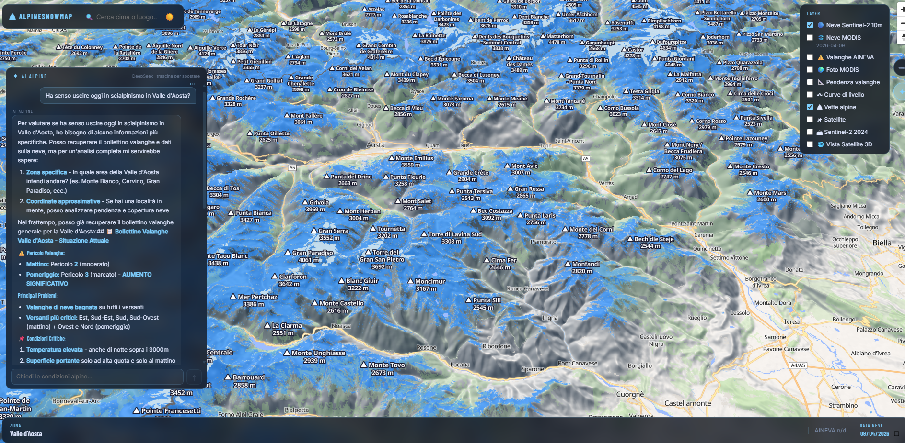

# AlpineSnowMap



Mappa interattiva delle condizioni nivologiche alpine italiane. Combina dati satellite, bollettini valanghe e un team di agenti AI specializzati per pianificare gite scialpinistiche in sicurezza.

## Funzionalità

- **Mappa 3D** — MapLibre GL con terreno DEM Terrarium, hillshade e stile OpenFreeMap Liberty
- **Layer neve**
  - MODIS Terra NDSI Snow Cover (giornaliero, NASA GIBS)
  - MODIS True Color (giornaliero)
  - Sentinel-2 10m cloudless basemap (EOX)
  - Copernicus Sentinel-2 NDSI snow cover live (via backend)
- **Bollettini valanghe** — EAWS/avalanche.report (IT-32-BZ, IT-32-TN) e AINEVA CAAML XML per tutte le province italiane
- **Vette** — Cime alpine da OpenStreetMap con pendenza DEM per ognuna
- **Pendenza** — Gradi di inclinazione calcolati server-side da DEM Terrarium
- **Curve di livello** — Topo vettoriali MapTiler
- **Satellite** — Esri World Imagery
- **Registrazione traccia GPX** — Waypoint manuali con profilo altimetrico ed esportazione GPX
- **Analisi rischio traccia** — Il pannello traccia invia il percorso all'agente AI per una valutazione del rischio
- **Ricerca luoghi** — Geocoding Nominatim
- **Click coordinate** — Clic sulla mappa mostra lat/lon con copia negli appunti
- **AI Alpine Chat** — Chat con agente singolo DeepSeek + 7 tool MCP per query in linguaggio naturale (drag & resize, rendering Markdown)
- **Team AI multi-agente** — 4 agenti specializzati coordinati da un leader, per analisi complete "ha senso uscire oggi?"

## Team di Agenti AI

Il backend espone due modalità AI:

### Agente singolo — `POST /api/agent/query`
Agente DeepSeek collegato a 7 tool MCP (pendenza, cime, neve, valanghe, analisi traccia). Ottimo per domande dirette su una zona o coordinate.

### Team coordinato — `POST /api/agent/team`
Quattro agenti specializzati lavorano in parallelo e un coordinatore sintetizza i risultati in un report strutturato.

```
┌─────────────────────────────────────────────────────────────┐
│                    Coordinatore (Team Leader)                 │
│         "Ha senso uscire oggi vicino a [zona]?"              │
│                  DeepSeek · coordinate mode                  │
└────────┬──────────────┬──────────────┬─────────────────┬────┘
         │              │              │                  │
         ▼              ▼              ▼                  ▼
  ┌──────────┐  ┌──────────────┐  ┌──────────┐  ┌───────────┐
  │ Agente   │  │ Agente       │  │ Agente   │  │ Agente    │
  │ Terreno  │  │ Neve/Meteo   │  │ Valanghe │  │ Web       │
  └──────────┘  └──────────────┘  └──────────┘  └───────────┘
```

#### Agente Terreno
- **Fonte:** OpenStreetMap (Overpass API) + DEM Terrarium 10m
- **Output:** Tabella cime vicine con quota, distanza, pendenza media/max, flag `ski_suitable` (25–35°)
- **Tool:** `get_nearby_peaks` + `get_slope_stats` per le 5 cime più vicine

#### Agente Neve/Meteo
- **Fonti:** Open-Meteo (gratuito, no API key) + NASA GIBS MODIS (500m daily) + Copernicus Sentinel-2 (10m, ~5 giorni)
- **Output:** Zero termico, vento, neve fresca 48h, copertura neve MODIS (oggi) e Sentinel-2 (% area, densa/leggera)
- **Segnala:** condizioni pericolose (vento >50 km/h, riscaldamento rapido)

#### Agente Valanghe
- **Fonti:** EAWS/avalanche.report (IT-32-BZ, IT-32-TN) → fallback AINEVA CAAML XML per le altre province
- **Output:** Livello di pericolo (1–5), problemi valanghivi, esposizioni e quote critiche
- **Regola:** non inventa mai pericoli; se entrambe le fonti falliscono, suggerisce aineva.it

#### Agente Web
- **Fonte:** DuckDuckGo (via `ddgs`, gratuito, no API key)
- **Output:** 2–3 link recenti (≤7 giorni) su condizioni neve e relazioni di gita nella zona
- **Ricerca:** "[zona] condizioni neve scialpinismo" + "[zona] valanghe aggiornamento"

#### Risposta del Coordinatore (esempio)
```markdown
## Cime vicine (raggio 10 km da 45.826°N 7.493°E)
| Cima            | Quota  | Dist   | Pend. media | Sci-alp |
|-----------------|--------|--------|-------------|---------|
| Monte Roisetta  | 3333 m | 2.1 km | 29°         | ✓       |
| Becca di Nona   | 3142 m | 3.8 km | 22°         | —       |
| Punta Tersiva   | 3515 m | 5.2 km | 31°         | ✓       |

## Neve e Meteo
- Zero termico: 2800 m · Vento: 15 km/h NW
- Neve fresca ultimi 2 giorni: 8 cm (Open-Meteo)
- Copertura neve oggi (MODIS 500m): neve presente ✓
- Copertura neve 5 apr (Sentinel-2 10m): 82% neve densa

## Bollettino Valanghe — Valle d'Aosta (EAWS)
- **Pericolo:** 2 (Limitato) sotto 2200 m · 3 (Marcato) sopra 2200 m
- Problemi: neve ventata (NE-E-SE sopra 2000 m)

## Notizie Recenti
- "Buone condizioni sui versanti nord di Torgnon..." — vallealpinenews.it (3 giorni fa)

## Verdetto
⚠️ Uscita possibile con attenzione: zero termico favorevole, ma pericolo marcato sopra 2200 m.
Consigliato: Monte Roisetta (versante N, partenza all'alba, rientro entro le 10:00).
```

## Stack

| Componente | Tecnologia |
|---|---|
| Frontend | React 19, Vite, MapLibre GL JS |
| Backend | FastAPI, Python 3.11+ |
| AI Agent | Agno + DeepSeek (via OpenAI-compatible API) |
| AI Team | Agno Team (coordinate mode), 4 agenti specializzati |
| MCP Server | FastMCP (SSE), 7 tool |
| Dati neve | NASA GIBS MODIS (500m), Copernicus Sentinel-2 (10m), Terrarium DEM |
| Meteo | Open-Meteo (gratuito, no API key) |
| Bollettini | EAWS/avalanche.report + AINEVA CAAML v5.0 XML |
| Ricerca web | DuckDuckGo via ddgs (gratuito, no API key) |

## Avvio rapido

### Windows — un click
```
start.bat
```
Crea il virtualenv, installa le dipendenze, avvia backend e frontend in finestre separate.

### Manuale

**Backend**
```bash
cd backend
python -m venv .venv
.venv/Scripts/python -m pip install -r requirements.txt
cp .env.example .env   # e compila le chiavi
.venv/Scripts/python -m uvicorn main:app --reload --port 8000
```

**Frontend**
```bash
cd frontend
npm install
npm run dev
```

- Frontend: http://localhost:5173
- Backend API: http://localhost:8000
- Docs API: http://localhost:8000/docs
- MCP SSE: http://localhost:8000/mcp/sse

## Configurazione

### `backend/.env`
```
# Copernicus Data Space Ecosystem — OAuth client credentials
# Registrazione gratuita su https://dataspace.copernicus.eu
COPERNICUS_CLIENT_ID=your_client_id_here
COPERNICUS_CLIENT_SECRET=your_client_secret_here

# AI Agent — DeepSeek
# Chiave su https://platform.deepseek.com
DEEPSEEK_API_KEY=sk-...
AGENT_PROVIDER=deepseek
AGENT_MODEL_ID=deepseek-chat

# CORS — origini separate da virgola
ALLOWED_ORIGINS=http://localhost:5173,http://localhost:5174

# MCP SSE URL (interno — stesso processo)
MCP_SSE_URL=http://localhost:8000/mcp/sse
```

### `frontend/.env.local`
```
VITE_API_BASE_URL=http://localhost:8000
VITE_MAPTILER_KEY=...        # gratuito su maptiler.com (per font e topo)
VITE_USE_MOCK=false
```

## Province supportate

| Codice | Zona |
|---|---|
| IT-21 | Piemonte |
| IT-23 | Valle d'Aosta |
| IT-25 | Lombardia |
| IT-32-BZ | Alto Adige / Südtirol |
| IT-32-TN | Trentino |
| IT-34 | Veneto |
| IT-36 | Friuli Venezia Giulia |
| IT-57 | Toscana (Appennino) |

## API Endpoints

| Metodo | Path | Descrizione |
|--------|------|-------------|
| `POST` | `/api/agent/query` | Agente singolo — domanda libera in italiano |
| `POST` | `/api/agent/team` | Team 4 agenti — analisi completa con verdetto finale |
| `POST` | `/api/agent/route` | Analisi rischio traccia GPX |
| `GET` | `/api/peaks` | Cime alpine italiane (Overpass API, cache permanente) |
| `GET` | `/api/aineva/{province}` | Bollettino valanghe per provincia |
| `GET` | `/api/snow/{z}/{x}/{y}.png` | Tile neve Copernicus Sentinel-2 NDSI |
| `GET` | `/api/slope/{z}/{x}/{y}.png` | Tile pendenza DEM (zoom 7–14) |
| `GET` | `/mcp/sse` | MCP SSE endpoint (agenti + Claude Desktop) |

### Formato richiesta team
```json
POST /api/agent/team
{
  "message": "Quali cime sono adatte oggi vicino a Torgnon?",
  "province": "IT-23"
}
```

## Note tecniche

- Il layer MODIS ha latenza di ~1–2 giorni su NASA GIBS; l'app cerca automaticamente la data più recente disponibile
- Sentinel-2 ha revisita ~5 giorni — dati non giornalieri
- I bollettini valanghe sono cachati 6 ore nel backend
- EAWS/avalanche.report è usato come fonte primaria per IT-32-BZ e IT-32-TN; AINEVA come fallback per le altre province
- Il team AI ha timeout di 60s per chiamata — le risposte del team richiedono più tempo dell'agente singolo
- Tutti gli agenti seguono la regola "mai inventare dati": se un tool fallisce, lo dichiarano esplicitamente
- Le API validano le coordinate (bounding box Alpi italiane: lat 44–47.2°, lon 6.5–14°) e i codici provincia; input non validi restituiscono HTTP 400
- Le costanti di configurazione (soglie pendenza, NDSI, colori rischio) sono centralizzate in `backend/config.py`
